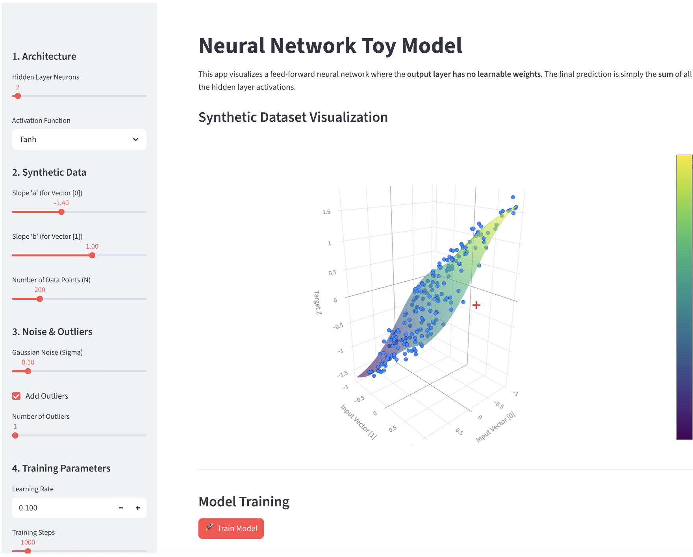

# Neural Network Toy Model

🚀 **Live Demo:** [https://nnmodel.streamlit.app/](https://nnmodel.streamlit.app/)



An interactive web application built with [Streamlit](https://streamlit.io/) and [JAX](https://github.com/google/jax) to train and visualize a simple feed-forward neural network.

This app is designed for educational purposes, allowing you to explore how a neural network learns a synthetic 3D surface mapping. Specifically, it uses a simplified architecture where the **output layer has no learnable weights**—the final prediction is simply the **sum** of all hidden layer activations.

## Features

* **Interactive Architecture Tuning**: Adjust the number of hidden neurons and toggle between playing with `ReLU` and `Tanh` activations.
* **Custom Synthetic Data**: Generate a synthetic dataset by controlling slopes, adding Gaussian noise, and injecting outliers.
* **Regularization Options**: Experiment with standard regularizations (L1, L2) and non-standard penalties (Inverse L1, Inverse L2, Log) to see their effect on weight dynamics.
* **Real-time Training & Visualization**: Watch the model train in real-time. Visualize the loss curve, tracking training loss vs. validation MSE.
* **Weight Dynamics**: Inspect how the weights ($W_1$) evolve over time and view their final distribution as 2D vectors.
* **3D Surface Comparisons**: Beautiful interactive Plotly visualizations comparing the true target surface beneath the generated data to the model's final predicted surface.

## Installation

1. Clone the repository:
   ```bash
   git clone https://github.com/ineporozhnii/neural-network-toy-model.git
   cd neural-network-toy-model
   ```

2. Install the required dependencies:
   ```bash
   pip install streamlit jax jaxlib numpy plotly pandas
   ```
   *(Note: For GPU support with JAX, follow the [official JAX installation guide](https://jax.readthedocs.io/en/latest/installation.html)).*

## Usage

Run the Streamlit application:

```bash
streamlit run app.py
```

This will open the application in your default web browser where you can interactively adjust parameters and observe the training process.

## License
See the `LICENSE` file for details.
